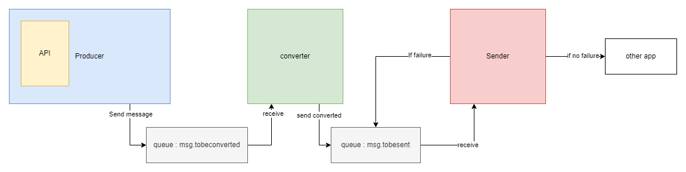

Small project created while reading the book [Spring in Action](https://www.manning.com/books/spring-in-action-fifth-edition).

I test here the capabilities of [RabbitMQ](https://www.rabbitmq.com/) with [SpringBoot](https://spring.io/projects/spring-boot).

The system I made has the following design : 

